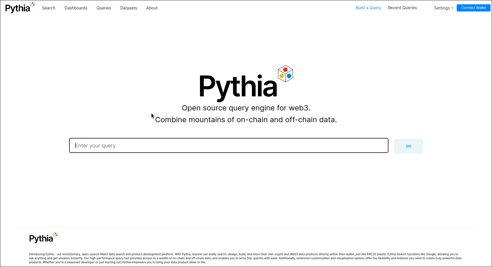
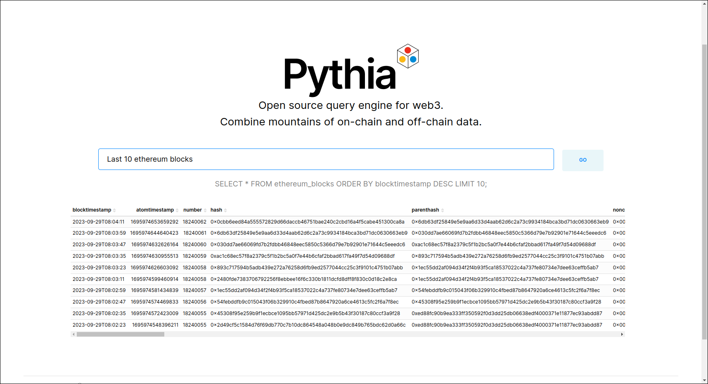

# Pythia V1

A proof of concept fork of [Apache Superset](https://github.com/apache/superset) with added natural language queries, XNode integration, and attempted Web3 account sign-in.

Try it out at [here](https://query.tech.openmesh.network/search/).

## Screenshots

## Running locally
This version of Pythia is tightly coupled with our underlying XNode deployment system, so running it locally is not recommended.

## Info on changes

### Natural Language Queries
Uses GPT-3.5 to translate queries to SQL commands which get sent to the underlying postgres database.

To mitigate hallucinations, the end user is never shown the AI's direct output.
If a query is fails the user just gets a generic error message.

Additionaly, for this version we assume no sensitive data is stored in the main database.
In future versions a more robust permission scheme should be added to prevent the AI from leaking info.

### XNode integration
Pythia is able to analyse data coming from an XNode.
The [collectors](https://github.com/Openmesh-Network/openmesh-collectors) and pythia are both run as helm charts on a live XNode.
Running on the same kubernetes, they also share the same postgres database and are configured to do so.

### Web3 account sign-in
The idea is to be able to make an account without email by using a web3 wallet.
It's partially implemented but not working in the current version.
